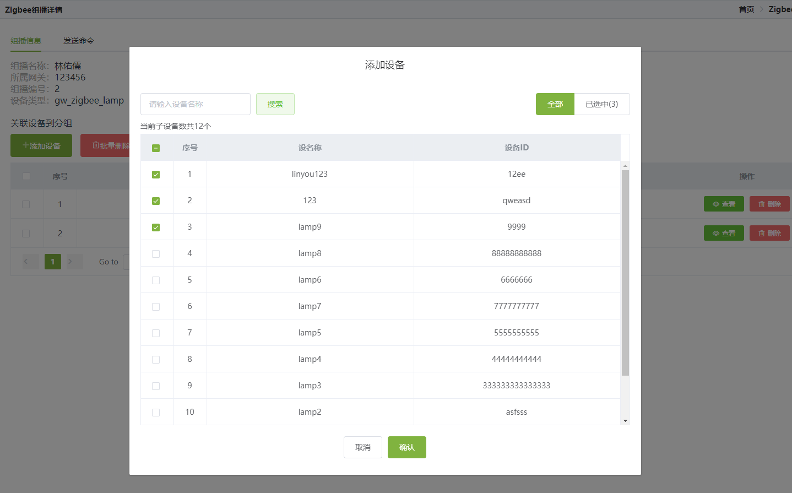

## 前言

开发Zigbee、LORaWAN组播模块过程中遇到了一个需求，一个带条件搜索的多选列表需要在全部数据和已选中的数据中切换，同时保持多选状态；期间遇到了一些问题，特此记录。

## 需求描述

- 列表可通过**全部**、**已选中**切换列表数据
- 在**全部**选项表格数据支持条件搜索
- 任何操作均需保持列表的实时选中状态



## 实现方法

实现的关键点在于需要维护一个数组存储列表实时的选中数据，同时在列表数据发生变化时能正确回显实时选中状态。

- 维护实时选中状态

在选择element table事件时要选择select而不是selection-change，因为selection-change只返回当前选中的row数组，在取消选中的状态下无法得知哪些数据被取消选中。

```javascript
let realTimecheckedDevices: any = []; //实时选中的设备（已选择列表）

/**添加设备弹窗多选回调 */
function handleSelect(selection: any, row: any) {
    const ids = [];
    for (const device of selection) {
        ids.push(device.id);
    }
    if (ids.includes(row.id)) {
        //包含则为选中
        realTimecheckedDevices.push(row);
    } else {
        //不包含则是取消选中,取消前一定是选中状态的，所以实时选中数组里有
        for (let index = 0; index < realTimecheckedDevices.length; index++) {
            if (realTimecheckedDevices[index].id === row.id) {
                realTimecheckedDevices.splice(index, 1);
            }
        }
    }
    dialogSelectTotal.value = realTimecheckedDevices.length;
}
```

- 回显选中状态

  回显时根据实时的选中数据数组，通过element table toggleRowSelection使全部列表维持选中状态

```javascript
/**获取符合分组条件的设备列表 */
function getSubDevice() {
    const filter = {
        prefix: selectDevName.value,
        tenant_id: thisGroupInfo.tenantId,
        info_model_ids: thisGroupInfo.sub_info_model_id,
        page_size: 1000
    }
    window.ZWSApi.ZWSThings.things_getThings(filter).then((res: any) => {
        dialogTableData.length = 0;
        dialogTotal.value = res.pagination.total_size;
        if (res.list && res.list.length > 0) {
            for (const device of res.list) {
                dialogTableData.push(device);
                for (const item of realTimecheckedDevices) {
                    if (item.id === device.id) {
                        //回显已选择的设备，toggleRowSelection(item, false)中的item一定得是表格的行数据，值相等也不行。
                        dialogTableTableRef.value.multipleTable.toggleRowSelection(device, true);
                    }
                }
            }
        }
    }).catch((error: any) => { console.log(error) });
}
```

- 全选/全不选

  由于element table select-all只返回选中的row数组，所以在条件搜索的情景下**全不选**会导致selection为空数组，不知道取消的是哪些设备，只能通过当前列表中的数据判断取消的数据。

  ```javascript
  /**添加设备弹窗全选回调 */
  function selectAll(selection: any) {
      const realTimecheckedIds = [];
      for (const realTimecheckedDevice of realTimecheckedDevices) {
          realTimecheckedIds.push(realTimecheckedDevice.id);
      }
      if (selection.length > 0) {
          //selection不为空则是添加，当前选中数组添加selection中新增项
          for (const item of selection) {
              if (!realTimecheckedIds.includes(item.id)) {
                  realTimecheckedDevices.push(item);
              }
          }
      } else {
          //selection为空则是取消，当前选中数组删除当前表格中的行
          for (const tableData of dialogTableData) {
              for (let index = 0; index < realTimecheckedDevices.length; index++) {
                  if (tableData.id === realTimecheckedDevices[index].id) {
                      realTimecheckedDevices.splice(index, 1);
                  } else {
                      continue;
                  }
              }
          }
      }
      dialogSelectTotal.value = realTimecheckedDevices.length;
  }
  ```

  