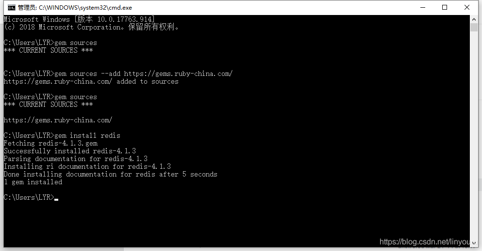
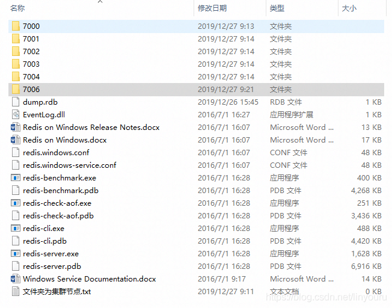
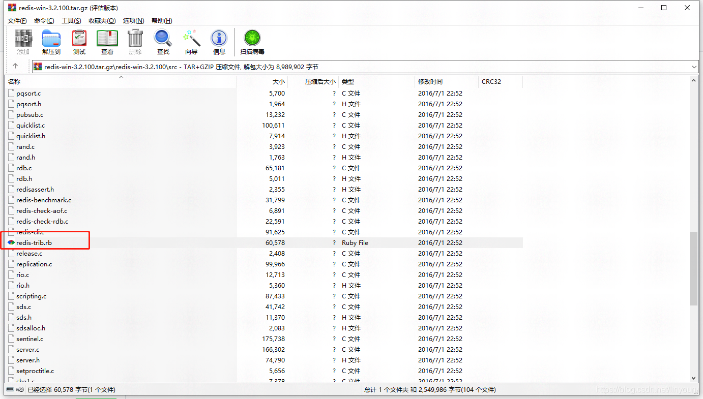
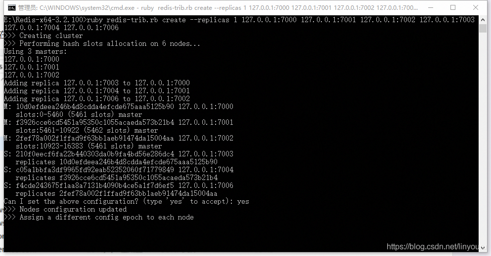
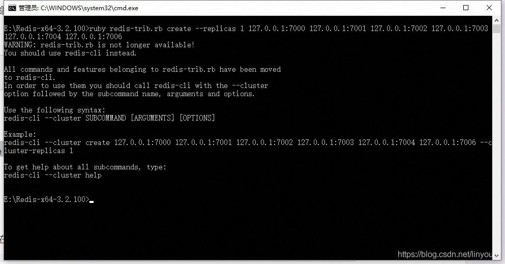

官网只提供Linux版本的集群配置，在此记录win10下的Redis集群配置

 

一、redis集群介绍

Redis cluster（redis集群）是在版本3.0后才支持的架构，和其他集群一样，都是为了解决单台服务器不够用的情况，也防止了主服务器宕机无备用服务器，多个节点网络互联数据共享，所有节点都是一主一从（也可以一主多从），其中从节点不提供服务，只做为备份

 

二、所需环境

 

1、redis3.0以上

2、安装Ruby语言运行环境

 

 

BUG1：在安装Ruby后进行gem install redis操作时报错

 

ERROR:  Could not find a valid gem 'redis' (>= 0), here is why:

          Unable to download data from https://rubygems.org/ - SSL_connect returned=1 errno=0 state=SSLv3 read server certificate B: certificate verify failed (https://api.rubygems.org/specs.4.8.gz)

 

这是由于gem源被墙掉了，所以要切换国内源，参考《修改 ruby 的 gem 镜像》的过程中又发现了新的问题。。。

 

BUG2：

Error fetching https://gems.ruby-china.com/:

        SSL_connect returned=1 errno=0 state=SSLv3 read server certificate B: certificate verify failed (https://gems.ruby-china.com/specs.4.8.gz)

 

这个是因为证书问题导致的，解决方法如下：

1、下载安装最新的Ruby

2、下载新的证书

3、添加环境变量SSL_CERT_FILE指向证书路径

 

不过我发现安装Ruby最新版本2.6.5-1后在Ruby26-x64\ssl下已经自带了证书，只需要添加环境变量就好。。。至此环境问题得以解决

 

三、集群步骤

 

1、在redis文件夹下新建6个节点文件夹7000-7006（没有使用7005是因为端口被占用）

要让集群正常运作至少需要三个主节点，不过在刚开始试用集群功能时， 强烈建议使用六个节点： 其中三个为主节点， 而其余三个则是各个主节点的从节点

2、将redis文件夹中的文件复制到每个节点文件夹下

 

3、修改redis.windows.conf配置

 

port 7000

cluster-enabled yes

cluster-config-file nodes.conf

cluster-node-timeout 15000

appendonly yes

 

port ：节点端口号

cluster-enabled ： 选项用于开实例的集群模式

cluster-config-file ：选项则设定了保存节点配置文件的路径， 默认值为 nodes.conf.节点配置文件无须人为修改， 它由 Redis 集群在启动时创建， 并在有需要时自动进行更新

 

4、编写启动文件start.bat

 

title redis-7000

redis-server.exe redis.windows.conf

 

 

5、启动各个节点

BUG3：在启动7005节点时报错Creating Server TCP listening socket 127.0.0.1:7005: bind: No error

原因：端口被占用，修改端口即可

 

 

6、下载安装集群脚本 redis-trib.rb  安装到redis目录下

下载地址  https://github.com/MicrosoftArchive/redis/releases

找到对应redis版本的tar.gz文件，如果版本不对应会出现下面的一个bug4

 

7、在redis目录下执行：

ruby redis-trib.rb create --replicas 1 127.0.0.1:7000 127.0.0.1:7001 127.0.0.1:7002 127.0.0.1:7003 127.0.0.1:7004 127.0.0.1:7006

 

–replicas 1 表示我们希望为集群中的每个主节点创建一个从节点

在出现 Can I set the above configuration? (type 'yes' to accept):   请确定并输入 yes 。

 

如果集群配置成功的话最终会输出：[OK] All 16384 slots covered 这表示集群中的 16384 个槽都有至少一个主节点在处理， 集群运作正常。

 

 

Bug4：在执行ruby redis-trib.rb create --replicas 1 127.0.0.1:7000 127.0.0.1:7001 127.0.0.1:7002 127.0.0.1:7003 127.0.0.1:7004 127.0.0.1:7006 报错

 

原因：redis-trib.rb版本与redis不匹配

 

至此win10下的redis集群以搭建完毕

 

四、测试

在7000中存入一个String，其从节点7003中也会同步该数据

 

 

后记：6个节点中加入集群的只有前4个，7004、7006节点并未加入集群中，原因暂时未知，删除节点下的nodes-xxx.conf文件后重新做一次集群所有的节点都加入了集群

 

问题：

集群节点宕机后怎么容灾？

A：cluster模式自带容灾机制，不需要额外添加哨兵。当主节点宕机后会将从节点升级为主节点，当原主节点恢复后会变为从节点。

 

 

 

参考：

Windows下 搭建redis集群
https://www.cnblogs.com/thirteen-zxh/p/9187875.html

redis主从架构宕机问题解决
https://blog.csdn.net/zhoujian_Liu/article/details/80866415

http://www.redis.cn/topics/cluster-tutorial.html

Bug1 https://blog.csdn.net/hsl0530hsl/article/details/80056289

Bug2 https://ruby-china.org/topics/33843

Bug3 https://blog.csdn.net/qq_39478853/article/details/79516038

Bug4 https://blog.csdn.net/aaaadong/article/details/82625567