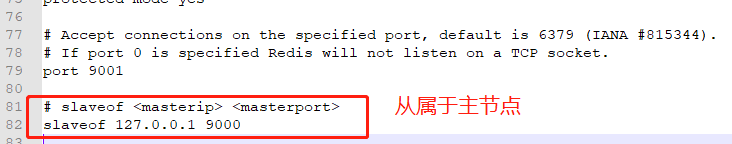
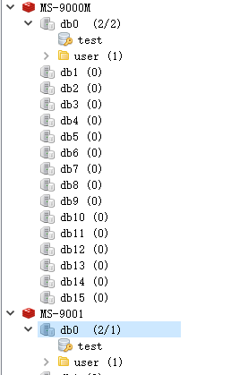

简单实现redis主从模式，一主多从。

 

一、主从模式的一些特性：

 

1.一个master可以有多个slave

2.除了多个slave连到相同的master外，slave也可以连接其他slave形成图状结构

3.主从复制不会阻塞master。也就是说当一个或多个slave与master进行初次同步数据时，master可以继续处理client发来的请求。相反slave在初次同步数据时则会阻塞不能处理client的请求。

4.主从复制可以用来提高系统的可伸缩性,我们可以用多个slave 专门用于client的读请求，比如sort操作可以使用slave来处理。也可以用来做简单的数据冗余

5.可以在master禁用数据持久化，只需要注释掉master 配置文件中的所有save配置，然后只在slave上配置数据持久化。

6.可以用于读写分离和容灾恢复（由于主节点数据并不是实时同步到从节点，主节点宕机可能会丢失数据）。

 

二、实现

 

1、创建多个文件夹，并将redis下的文件copy到每个文件夹中

 

2、修改redis.windows.conf配置文件

主节点修改端口号，从节点设置从属于主节点

 

slaveof <masterip> <masterport>

slaveof 127.0.0.1 9000

 

3、编辑启动文件start.bat

 

title redis-9001

redis-server.exe redis.windows.conf

 

依次启动主从节点，并在主节点中存储数据，可看到从节点会同步主节点中的数据

 

 

 

参考

https://www.cnblogs.com/aflyun/p/8495561.html