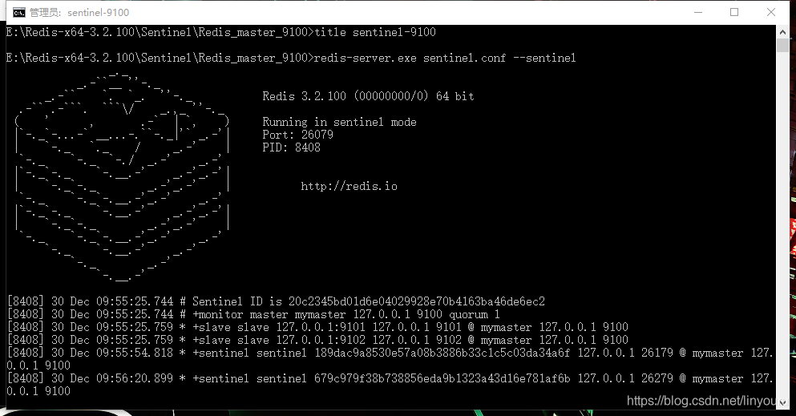
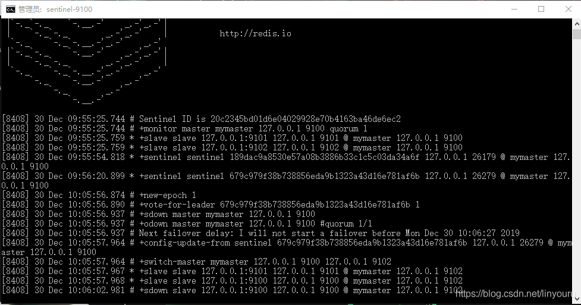
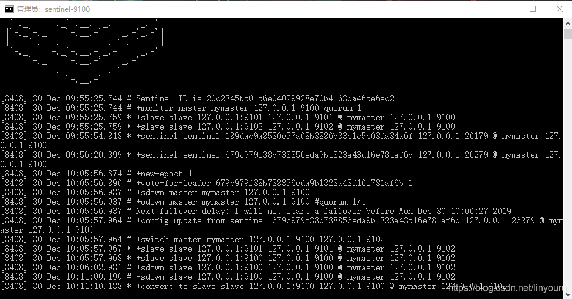

前言：

 

在上一篇文章里，实现了Redis主从模式集群；主从模式的弊端就是不具备高可用性，当master挂掉以后，Redis将不能再对外提供写入操作，因此sentinel应运而生。本文尝试使用哨兵模式搭建。

 

 

一、sentinel模式介绍

 

Redis 的 Sentinel 系统用于管理多个 Redis 服务器（instance）， 该系统执行以下三个任务：

 

监控（Monitoring）： Sentinel 会不断地检查你的主服务器和从服务器是否运作正常。

提醒（Notification）： 当被监控的某个 Redis 服务器出现问题时， Sentinel 可以通过 API 向管理员或者其他应用程序发送通知。

自动故障迁移（Automatic failover）： 当一个主服务器不能正常工作时， Sentinel 会开始一次自动故障迁移操作， 它会将失效主服务器的其中一个从服务器升级为新的主服务器， 并让失效主服务器的其他从服务器改为复制新的主服务器； 当客户端试图连接失效的主服务器时， 集群也会向客户端返回新主服务器的地址， 使得集群可以使用新主服务器代替失效服务器。

Redis Sentinel 是一个分布式系统， 你可以在一个架构中运行多个 Sentinel 进程（progress）， 这些进程使用流言协议（gossip protocols)来接收关于主服务器是否下线的信息， 并使用投票协议（agreement protocols）来决定是否执行自动故障迁移， 以及选择哪个从服务器作为新的主服务器。

 

虽然 Redis Sentinel 释出为一个单独的可执行文件 redis-sentinel ， 但实际上它只是一个运行在特殊模式下的 Redis 服务器， 你可以在启动一个普通 Redis 服务器时通过给定 –sentinel 选项来启动 Redis Sentinel 。

 

二、实现

 

主从模式搭建同上一篇文章，这里不再重复，采用一主两从的架构，端口为：9100、9101、9102

 

1、在每个redis节点文件夹内创建文件sentinel.conf

 

port 26179

sentinel monitor mymaster 127.0.0.1 9100 1

sentinel down-after-milliseconds mymaster 5000

sentinel failover-timeout mymaster 15000

 

2、编写Sentinel启动文件startup_sentinel.bat

 

title sentinel-9100

redis-server.exe sentinel.conf --sentinel

 

3、依次启动主从节点、然后启动Sentinel

 

可以看到主从节点及另外两个哨兵的信息

 

4、测试

在主节点中存入数据再将主节点（9100）关闭，可以看到9102变更为主节点，再将9100开启后将作为从节点加入到集群中

 

参考：

http://www.redis.cn/topics/sentinel.html

https://blog.csdn.net/ITLTX1024/article/details/100665452

https://www.cnblogs.com/SecondSun/p/11270547.html

https://blog.csdn.net/a1282379904/article/details/52335051/
