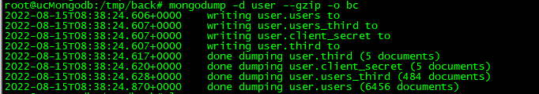

环境：ubuntu、mongodb 4.4、docker

数据库没开启鉴权

备份单个集合

mongodump -d user -c users --gzip -o bc

备份db下全部集合

mongodump -d user -c --gzip -o bc

备份数据恢复（开启鉴权）
mongorestore -d awtk-ide --username "xxx" --password "xxx" --gzip awtk-ide/
备份数据恢复（无鉴权）
mongorestore -d user --gzip user/

参考链接：
https://www.mongodb.com/docs/database-tools/mongodump/#options